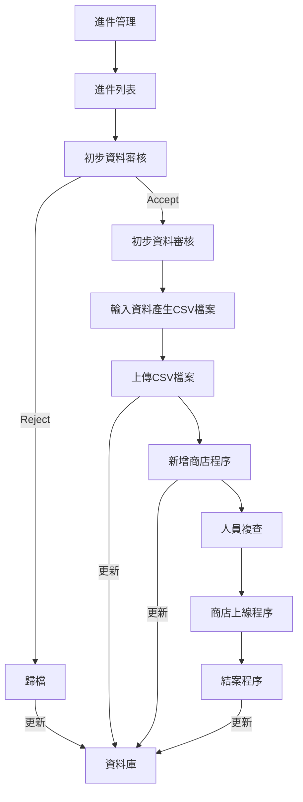
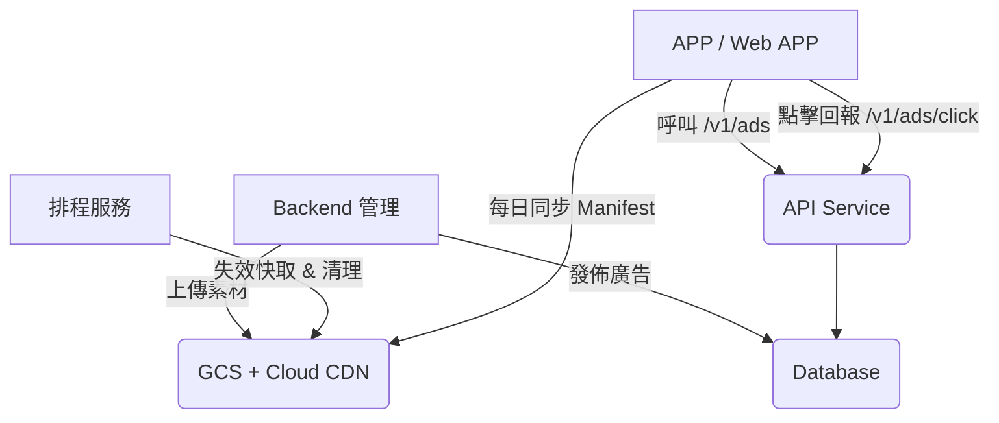

# 商店申請流程作業

使用在在 APP 上輸入申請成為會員的作業流程

## 資料來源

### Postgresql 資料表

詳細定義見[附錄 1]

## 進件管理作業流程



### 流程說明

#### 進件列表

由 API 取得進件未處理資料，顯示於畫面。

##### 畫面名稱

application_view.dart

##### 資料來源

lib/app/modules/application/controllers/application_controller.dart

#### 初步資料審核

檢查使用者申請資料與上傳的圖片，決定 ACCEPT/REJECT。

##### 畫面名稱

application_view.dart

##### UI

- 提供 ACCEPT/REJECT RadioBox 選項
- 決定 ACCEPT 選項後出現[上傳 CSV 檔案] ，讓使用者選擇檔案。
- 選擇檔案完畢後出現[新增商店]，成功後取得 API 回覆的商店編號 SID。

#### 歸檔

- 申請書被拒絕時。
- 更薪資料庫
  1. status='5' (結案)
  2. review_note ='審核原因'

lib/app/modules/application/controllers/application_controller.dart

#### 輸入資料產生 CSV 檔案

處理人員手動建立 CSV 檔案。

#### 上傳 CSV 檔案

#### 新增商店程序

#### 人員複查

#### 商店上線程序

#### 結案程序

###



> 附錄 1

```sql
-- Generated by the database client.
CREATE TABLE app_shop_request(
    id SERIAL NOT NULL,
    uid uuid NOT NULL,
    shop_name varchar(20) NOT NULL,
    shop_contact_name varchar(20) NOT NULL,
    shop_address varchar(20) NOT NULL,
    shop_phone varchar(20) NOT NULL,
    shop_mobile varchar(20) NOT NULL,
    shop_note varchar(20) NOT NULL,
    shop_image varchar(200) NOT NULL,
    shop_description varchar(20),
    shop_email varchar(50),
    shop_website varchar(150),
    shop_tax_id varchar(10),
    image_url varchar(500) NOT NULL,
    review_status varchar(20) NOT NULL DEFAULT 'PENDDING'::character varying,
    review_note varchar(150),
    review_at timestamp with time zone,
    review_by uuid,
    status varchar(1),
    review_by_name varchar(20),
    is_close boolean DEFAULT false,
    close_at timestamp with time zone,
    close_by uuid,
    close_by_name varchar(20),
    created_at timestamp with time zone NOT NULL DEFAULT now(),
    applicant_identity integer DEFAULT 1,
    PRIMARY KEY(id),
    CONSTRAINT review_status_check CHECK (((review_status)::text = ANY (ARRAY[('PENDDING'::character varying)::text, ('APPROVE'::character varying)::text, ('REJECT'::character varying)::text])))
);
COMMENT ON TABLE app_shop_request IS '商店申請表';
COMMENT ON COLUMN app_shop_request.id IS '申請序號';
COMMENT ON COLUMN app_shop_request.uid IS '申請人UID';
COMMENT ON COLUMN app_shop_request.shop_name IS '商店名稱';
COMMENT ON COLUMN app_shop_request.shop_contact_name IS '聯絡人';
COMMENT ON COLUMN app_shop_request.shop_address IS '地址';
COMMENT ON COLUMN app_shop_request.shop_phone IS '訂購電話';
COMMENT ON COLUMN app_shop_request.shop_mobile IS '行動電話';
COMMENT ON COLUMN app_shop_request.shop_note IS '訂購附註';
COMMENT ON COLUMN app_shop_request.shop_image IS 'Logo圖檔';
COMMENT ON COLUMN app_shop_request.shop_description IS '商店描述';
COMMENT ON COLUMN app_shop_request.shop_email IS '電子郵件';
COMMENT ON COLUMN app_shop_request.shop_website IS '網站';
COMMENT ON COLUMN app_shop_request.shop_tax_id IS '統一編號';
COMMENT ON COLUMN app_shop_request.image_url IS '圖檔';
COMMENT ON COLUMN app_shop_request.review_status IS '審核結果';
COMMENT ON COLUMN app_shop_request.review_note IS '審核附註';
COMMENT ON COLUMN app_shop_request.review_at IS '審核時間';
COMMENT ON COLUMN app_shop_request.review_by IS '審核人UID';
COMMENT ON COLUMN app_shop_request.review_by_name IS '審核人姓名';
COMMENT ON COLUMN app_shop_request.is_close IS '使否結案';
COMMENT ON COLUMN app_shop_request.close_at IS '結案時間';
COMMENT ON COLUMN app_shop_request.close_by IS '結案人UID';
COMMENT ON COLUMN app_shop_request.close_by_name IS '結案人姓名';
COMMENT ON COLUMN app_shop_request.created_at IS '申請建立時間';
COMMENT ON COLUMN app_shop_request.applicant_identity IS '申請人身分';
```
