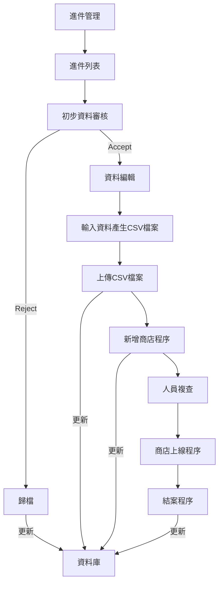

# 商店申請流程作業

使用在在 APP 上輸入申請成為會員的作業流程

## 資料來源

### Postgresql 資料表

詳細定義見[附錄 1]

## 進件管理作業流程



### 流程說明

#### 進件列表

由 API 取得進件未處理資料，顯示於畫面。

##### 畫面名稱 [進件列表]

程式名稱：application_request.dart

##### 資料來源

lib/app/modules/application/controllers/application_controller.dart
controller.applicationList

##### 商店顯示列表欄位

- 申請序號:id
- 申請人:申請人 UID
- 商店名稱:shop_name
- 狀態:status
- 審核人姓名:review_by_name
- 結案人姓名:close_by_name
- 審核結果:review_status
- 審核附註:review_note
- 申請建立時間:申請建立時間
- [檢視]/[編輯]

##### 資料說明

**status**

- 0:新案件
- 1:作業中
- 2:新增完成
- 3:複製資料
- 4:等待複檢
- 5:結案

**review_status**

- PENDDING:擱置中
- APPROVE:已核准
- REJECT:已拒絕

##### UI 動作

- 當[審核人姓名] 非空白時，該資料有審核人本人可以[編輯],其他人可以 [檢視]
  - review_by_uid = authService.currentUid [編輯]
  - review_by_uid != authService.currentUid [檢視]
  - 該案件鎖定，只有審核人可以進行作業，防止多人作業處理同一案件。
- [編輯] --> 畫面名稱 [進件案件 編輯]
- [檢視] --> 畫面名稱 [進件案件 檢視]
- 依照申請建立時間升冪排序
- 提供分頁導覽，每頁 n 筆,n 可以手動設定 n: 5,30,50,100 預設 n=30

#### 初步資料審核

檢查使用者申請資料與上傳的圖片，決定 ACCEPT/REJECT。

##### 畫面名稱 [進件案件 編輯/檢視]

application_edit.dart

##### UI

- 畫面 UI 設計與欄位
  **Table 1 基本資料**
  申請序號:id 商店名稱:shop_name 統一編號:shop_tax_id
  訂購電話:shop_phone 聯絡人:shop_contact_name 行動電話:shop_mobile
  網站:shop_website 電子郵件:shop_email
  地址:shop_address
  商店描述:shop_description
  訂購附註:shop_note
  **Table 2 審核結果**
  審核人姓名:review_by_name 審核結果:review_status 審核時間:審核時間
  審核附註:review_note
  結案人姓名:結案人姓名 是否結案:is_close 結案時間:結案時間
  申請書狀態:
  **Table 3 圖檔**
  圖檔:image_url

- 畫面呈現
  Row[
  Column[
  Table 1,
  Tbale 2

      ],
          Column[
          Table 3
      ],

  ]

**編輯模式**

- 顯示申請案件詳細資料
  - **顯示欄位**
    - 案件編號
    - 商店名稱
  - ## **可編輯欄位**
- **工具列**
- status=0
  - [拒絕案件申請] [核准案件申請]
  - [拒絕案件申請]
    - 顯示審核附註輸入欄位
    - [送出] --> contruller.reject(id)
  - [核准案件申請] -->contruller.accept(id)
- status=1
  - 審核結果:review_status 欄位無法修改
  - 審核附註:review_note 欄位無法修改
  - [儲存] [上傳 CSV 檔案]
    - [儲存] --> applicationSave()
    - [上傳 CSV 檔案] 讓使用者選擇檔案 -->contruller.uploadCSVAndAddShop(id)
    - API 完成**編輯異動**
    - API 完成**新增商店程序**
- status=2
  - 所有欄位些無法修改
  - [返回] 回到上一頁
- status=3
  - 所有欄位些無法修改
  - [返回] 回到上一頁
- status=4
  - 所有欄位些無法修改
  - [退回] [結案]
  - [退回] 資料有錯誤 --> contruller.caseReviewFailed(id)
  - [結案] 案件結案 --> contruller.caseClose(id)
    - API 完成**商店上線程序**
    - API 完成**結案程序**
- status=5
  - 所有欄位些無法修改
  - [返回] 回到上一頁

**檢視模式**

- 顯示申請案件詳細資料(與編輯模式相同)
  - 所有欄位階無法異動
- **工具列**-
  - [返回] 回到上一頁

> 附錄 1

```sql
-- Generated by the database client.
CREATE TABLE app_shop_request(
    id SERIAL NOT NULL,
    uid uuid NOT NULL,
    shop_name varchar(20) NOT NULL,
    shop_contact_name varchar(20) NOT NULL,
    shop_address varchar(20) NOT NULL,
    shop_phone varchar(20) NOT NULL,
    shop_mobile varchar(20) NOT NULL,
    shop_note varchar(20) NOT NULL,
    shop_image varchar(200) NOT NULL,
    shop_description varchar(20),
    shop_email varchar(50),
    shop_website varchar(150),
    shop_tax_id varchar(10),
    image_url varchar(500) NOT NULL,
    review_status varchar(20) NOT NULL DEFAULT 'PENDDING'::character varying,
    review_note varchar(150),
    review_at timestamp with time zone,
    review_by uuid,
    review_by_name varchar(20),
    is_close boolean DEFAULT false,
    close_at timestamp with time zone,
    close_by uuid,
    close_by_name varchar(20),
    created_at timestamp with time zone NOT NULL DEFAULT now(),
    applicant_identity integer DEFAULT 1,
    status varchar(1) DEFAULT '0'::character varying,
    PRIMARY KEY(id),
    CONSTRAINT review_status_check CHECK (((review_status)::text = ANY (ARRAY[('PENDDING'::character varying)::text, ('APPROVE'::character varying)::text, ('REJECT'::character varying)::text])))
);
COMMENT ON TABLE app_shop_request IS '商店申請表';
COMMENT ON COLUMN app_shop_request.id IS '申請序號';
COMMENT ON COLUMN app_shop_request.uid IS '申請人UID';
COMMENT ON COLUMN app_shop_request.shop_name IS '商店名稱';
COMMENT ON COLUMN app_shop_request.shop_contact_name IS '聯絡人';
COMMENT ON COLUMN app_shop_request.shop_address IS '地址';
COMMENT ON COLUMN app_shop_request.shop_phone IS '訂購電話';
COMMENT ON COLUMN app_shop_request.shop_mobile IS '行動電話';
COMMENT ON COLUMN app_shop_request.shop_note IS '訂購附註';
COMMENT ON COLUMN app_shop_request.shop_image IS 'Logo圖檔';
COMMENT ON COLUMN app_shop_request.shop_description IS '商店描述';
COMMENT ON COLUMN app_shop_request.shop_email IS '電子郵件';
COMMENT ON COLUMN app_shop_request.shop_website IS '網站';
COMMENT ON COLUMN app_shop_request.shop_tax_id IS '統一編號';
COMMENT ON COLUMN app_shop_request.image_url IS '圖檔';
COMMENT ON COLUMN app_shop_request.review_status IS '審核結果';
COMMENT ON COLUMN app_shop_request.review_note IS '審核附註';
COMMENT ON COLUMN app_shop_request.review_at IS '審核時間';
COMMENT ON COLUMN app_shop_request.review_by IS '審核人UID';
COMMENT ON COLUMN app_shop_request.review_by_name IS '審核人姓名';
COMMENT ON COLUMN app_shop_request.is_close IS '是否結案';
COMMENT ON COLUMN app_shop_request.close_at IS '結案時間';
COMMENT ON COLUMN app_shop_request.close_by IS '結案人UID';
COMMENT ON COLUMN app_shop_request.close_by_name IS '結案人姓名';
COMMENT ON COLUMN app_shop_request.created_at IS '申請建立時間';
COMMENT ON COLUMN app_shop_request.applicant_identity IS '申請人身分';
COMMENT ON COLUMN app_shop_request.status IS '申請書狀態';

```

**Table 1 基本資料**
申請序號:id 商店名稱:shop_name 統一編號:shop_tax_id
訂購電話:shop_phone 聯絡人:shop_contact_name 行動電話:shop_mobile
網站:shop_website
電子郵件:shop_email
地址:shop_address
商店描述:shop_description
訂購附註:shop_note
**Table 2 審核結果**
審核人姓名:review_by_name 審核結果:review_status 審核時間:審核時間
審核附註:review_note
結案人姓名:結案人姓名 是否結案:is_close 結案時間:結案時間
申請書狀態:
**Table 3 圖檔**
圖檔:image_url

畫面呈現
Row[
Column[
Table 1,
Tbale 2

    ],
        Column[
        Table 3
    ],

]

> Application Model
> lib/app/models/application/application_model.dart

```dart
 int id;
  String? reviewNote;
  String imageUrl;
  String? closeAt;
  String? closeBy;
  String? shopImage;
  String shopAddress;
  String uid;
  String? shopMobile;
  String shopName;
  String? shopEmail;
  String? shopDescription;
  String reviewStatus;
  String? closeByName;
  String shopPhone;
  String shopContactName;
  String? reviewBy;
  String status;
  String shopWebsite;
  bool isClose;
  String? reviewerName;
  String? shopTaxId;
  String? shopNote;
  int applicantIdentity;
  String? reviewAt;
  String? reviewByName;
  String createdAt;
  String? closerName;
  String userName;

```
